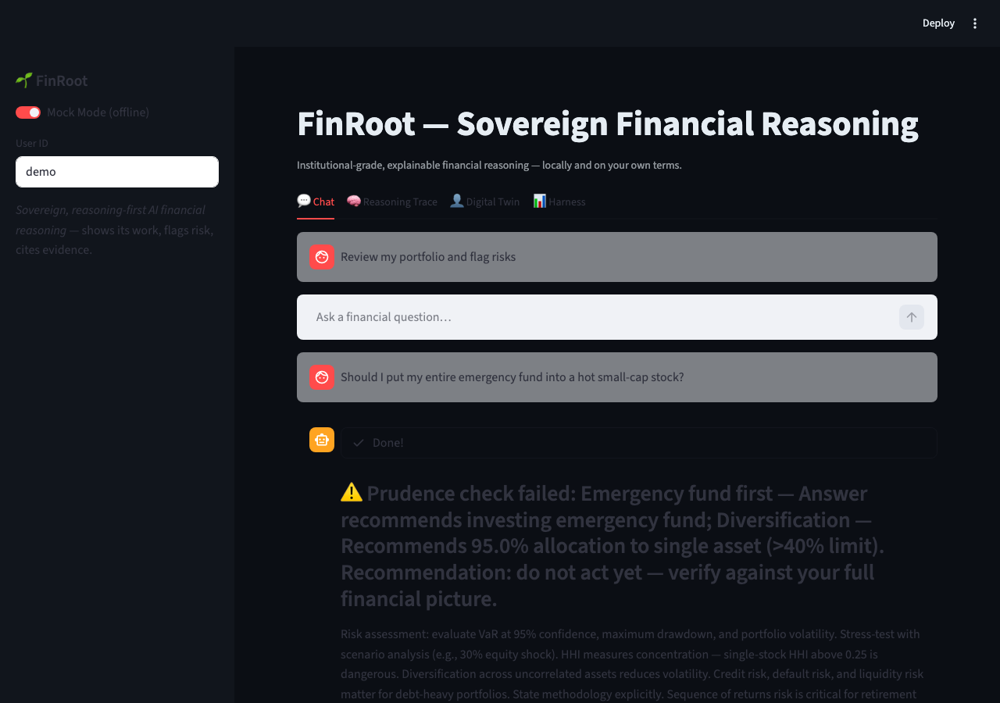
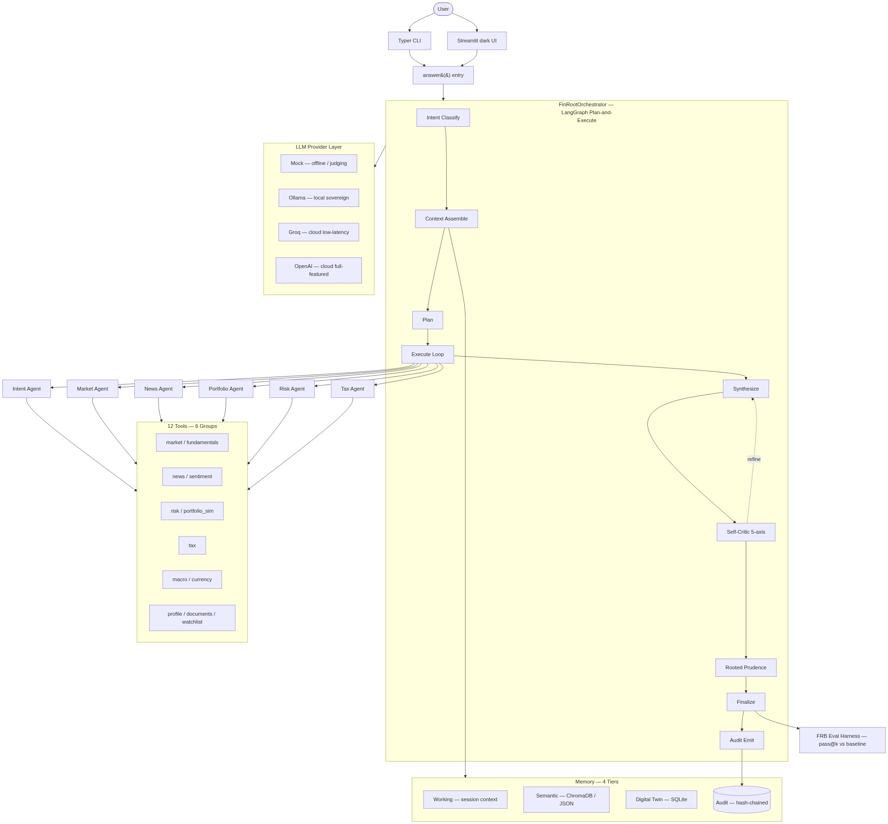
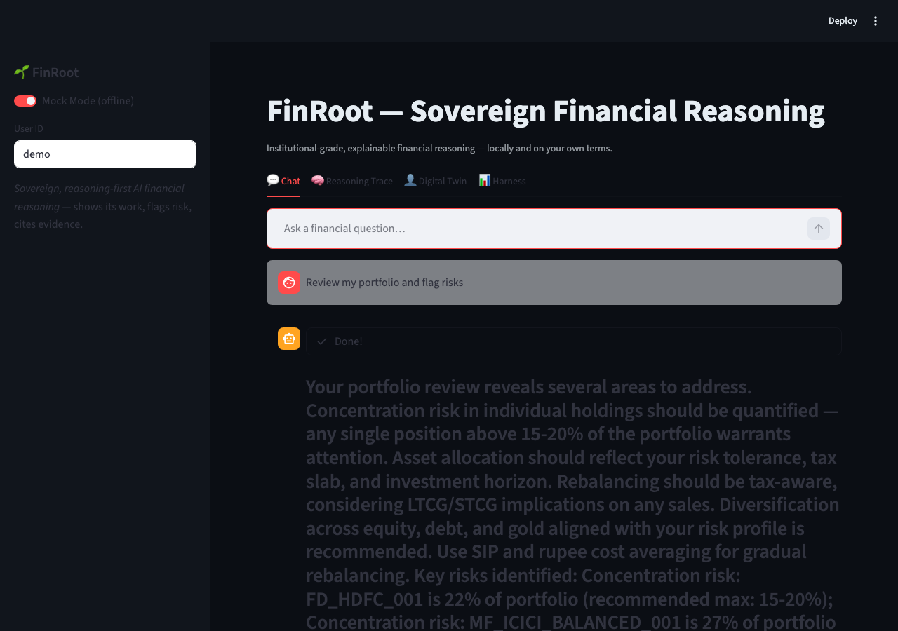
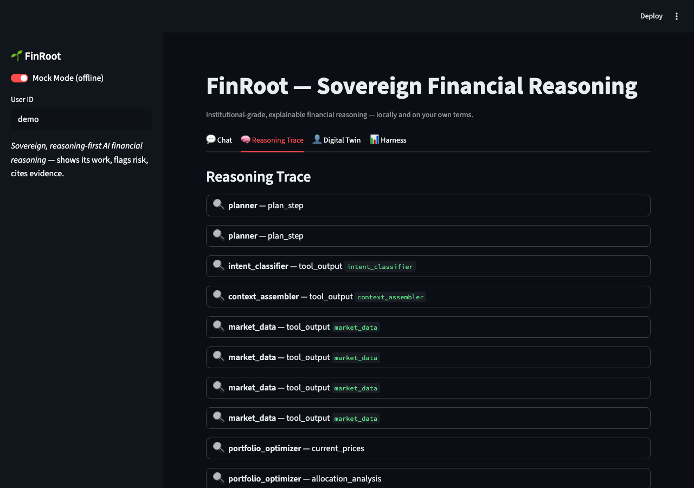
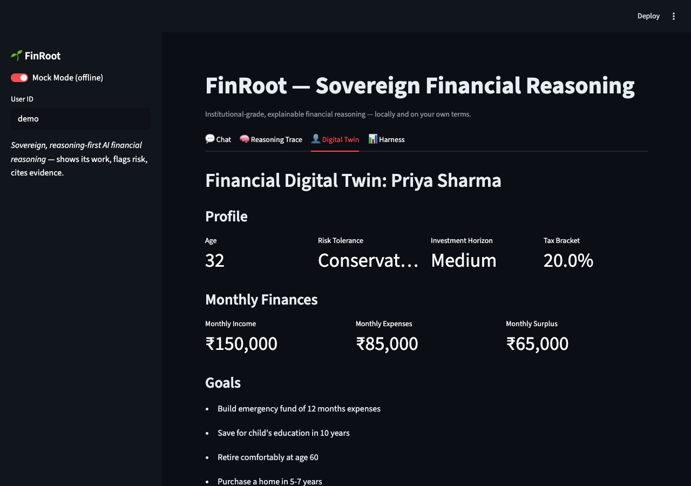
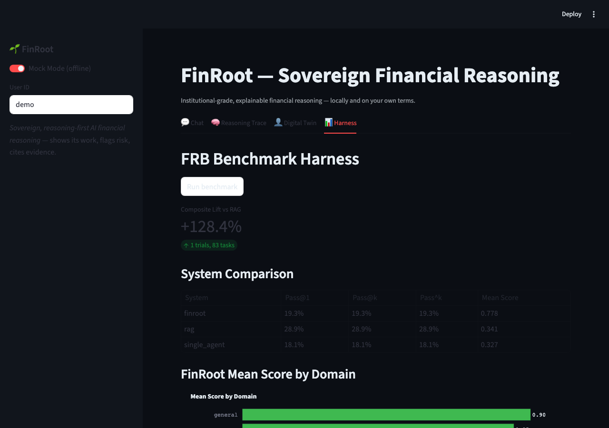

<div align="center">

# 🌳 FinRoot
### Sovereign · Reasoning-First · Auditable AI Financial Agent

**Institutional-grade financial reasoning for the individual — local, explainable, trustworthy.**

[](https://www.python.org/)
[](#-verification)
[](LICENSE)
[](#)
[](#-sovereignty--audit)
[](CONTRIBUTING.md)

*Built with **LangChain + LangGraph · Pydantic v2 · ChromaDB · SQLite · Streamlit**. Submitted to
SCALE ML Club — Problem Statement 1: **Build an AI Agent for Finance**.*

</div>

<div align="center">

## ⚡ See it in action

[](docs/demo/hero.md)

*Click the image for the full CLI demo — portfolio review, tax calculation, and prudence refusal.*

</div>

---

## The one-line pitch

> **Give an individual investor / small family office institutional-grade, explainable,
> auditable financial reasoning — locally and on their own terms.**

---

## 📉 The problem

Most financial "AI" today is a chatbot that calls a price API and asks an LLM to summarize.
That is not advice — it is a guess with no trace.

| Pain | What individuals face today |
|---|---|
| **No reasoning shown** | A confident sentence, no plan, no tools, no trace. |
| **No risk flags** | "Buy XYZ" with no drawdown estimate, no downside scenario. |
| **No citations** | Numbers without sources — fabricated or stale. |
| **No memory of *you*** | Each question is independent of your goals, taxes, holdings. |
| **No audit trail** | When advice goes wrong, there is nothing to replay or defend. |
| **Vendor lock-in** | Closed APIs, opaque data flows, no offline path. |

FinRoot is engineered against every one of those failures.

---

## ✅ What FinRoot does

A **multi-agent reasoning pipeline** that *decides, defends, and documents*.

- 🧠 **6-agent LangGraph orchestration** — Intent · Market · News · Portfolio · Risk · Tax agents
  coordinated by a Plan-and-Execute supervisor with refine loops.
- 🛠 **12 tools in 6 groups** — market data, fundamentals, news/sentiment, risk + portfolio_sim,
  deterministic tax engine, macro/currency, profile/documents/watchlist — all with caching,
  rate-limiting, loud-fail, and audit hooks (`src/finroot/tools/`).
- 🧬 **4-tier memory + Digital Twin** — working context · semantic (ChromaDB/JSON) · **Digital
  Twin** (SQLite, your goals/risk/horizon/holdings/tax-bracket) · audit (`src/finroot/memory/`).
- 🎯 **5-axis Self-Critic** — correctness · risk-awareness · actionability · explainability ·
  evidence-grounding. Low-scoring answers are refined before reaching you.
- 🪷 **Rooted Prudence verifier** — guards timeless wealth principles (long-term thinking,
  downside-first, no overclaiming). *Artha aligned with dharma.*
- 🔗 **Hash-chained audit trail** — every reasoning step, tool call, data source and
  assumption is tamper-evident and replayable.
- 🏠 **Sovereign-first** — local Ollama by default; offline Mock for zero-friction judging;
  no blind reliance on closed APIs.
- 📊 **FRB Reasoning-Quality harness** — a reproducible benchmark that *proves* the lift
  over a RAG baseline, not just claims it (`evals/`, `results/metrics.json`).

---

## 🏗 Architecture



<details>
<summary>Full diagram source (mermaid)</summary>

[docs/architecture/architecture.mmd](docs/architecture/architecture.mmd) — re-render with `bash scripts/render_diagram.sh`.

```mermaid
%% FinRoot Architecture Diagram
%% Render to PNG: bash scripts/render_diagram.sh
%%
%% Legend:
%%   [User]     — human end-user (investor / family office)
%%   [UI/CLI]   — Streamlit dark UI + Typer CLI entry points
%%   [Core]     — FinRootOrchestrator (LangGraph Plan-and-Execute loop)
%%   [Agent]    — 6 specialized reasoning agents
%%   [Tool]     — 12 tools in 6 functional groups (cache/rate-limit/loud-fail/audit)
%%   [Memory]   — 4-tier memory (working / semantic / digital-twin / audit)
%%   [Critic]   — Self-Critic (5-axis) + Rooted Prudence principles verifier
%%   [Audit]    — Hash-chained tamper-evident audit trail
%%   [LLM]      — LLM provider abstraction (Mock / Ollama / Groq / OpenAI)
%%   Arrows     — data / control flow direction

flowchart TD
    USER([User]) --> CLI[Typer CLI]
    USER --> UI[Streamlit dark UI]

    CLI --> ANSWER[answer&#40;&#41; entry]
    UI --> ANSWER

    subgraph ORCH[FinRootOrchestrator — LangGraph Plan-and-Execute]
        IC[Intent Classify] --> CA[Context Assemble]
        CA --> PL[Plan]
        PL --> EX[Execute Loop]
        EX --> SY[Synthesize]
        SY --> SC[Self-Critic 5-axis]
        SC --> RP[Rooted Prudence]
        RP --> FIN[Finalize]
        FIN --> AU[Audit Emit]
        SC -. refine .-> SY
    end

    ANSWER --> ORCH

    EX --> IA[Intent Agent]
    EX --> MA[Market Agent]
    EX --> NA[News Agent]
    EX --> PA[Portfolio Agent]
    EX --> RA[Risk Agent]
    EX --> TA[Tax Agent]

    subgraph TOOLS[12 Tools — 6 Groups]
        T1[market / fundamentals]
        T2[news / sentiment]
        T3[risk / portfolio_sim]
        T4[tax]
        T5[macro / currency]
        T6[profile / documents / watchlist]
    end

    IA --> TOOLS
    MA --> TOOLS
    NA --> TOOLS
    PA --> TOOLS
    RA --> TOOLS
    TA --> TOOLS

    subgraph MEM[Memory — 4 Tiers]
        WK[Working — session context]
        SM[Semantic — ChromaDB / JSON]
        DT[Digital Twin — SQLite]
        AD[(Audit — hash-chained)]
    end

    CA --> MEM
    AU --> AD

    subgraph LLM[LLM Provider Layer]
        MK[Mock — offline / judging]
        OL[Ollama — local sovereign]
        GQ[Groq — cloud low-latency]
        OA[OpenAI — cloud full-featured]
    end

    ORCH --> LLM

    FIN --> EVAL[FRB Eval Harness — pass@k vs baseline]
```
</details>

---

## 🎯 Judging-criteria mapping (SCALE ML Club PS-1)

We optimize for the four scoring weights and **show exactly where each is delivered**.

| Weight | Criterion | Where FinRoot earns it | Evidence |
|---:|---|---|---|
| **35%** | **Reasoning Quality** | 5-axis Self-Critic loop · Rooted Prudence verifier · Digital-Twin-grounded synthesis · FRB harness with RAG baseline delta | `src/finroot/reasoning/critic.py` · `src/finroot/reasoning/principles.py` · `evals/` · `results/metrics.json` |
| **30%** | **Agent Architecture** | LangGraph Plan-and-Execute supervisor · 6 specialized agents · 12-tool ecosystem · 4-tier memory · refine loops · hash-chained audit · LLM-provider abstraction | `src/finroot/workflows/orchestrator.py` · `src/finroot/agents/` · `src/finroot/tools/` · `src/finroot/memory/` · `src/finroot/audit/` · [`docs/architecture/architecture.mmd`](docs/architecture/architecture.mmd) |
| **20%** | **Code Implementation** | Modular `src/finroot/*` package layout · Pydantic v2 typed boundaries · pytest taxonomy (unit/integration/golden/fuzz/perf/security) · ruff-clean · CI workflow · Dockerized stack | `src/finroot/` · `tests/` · `.github/workflows/` · `Dockerfile` · `docker-compose.yml` |
| **15%** | **Solution Idea** | A new category: **sovereign, auditable reasoning over your financial Digital Twin** — long-term-thinking-first, downside-aware, locally runnable, with a reproducible proof harness | `plan/PRD.md` · [`docs/SUBMISSION.md`](docs/SUBMISSION.md) · [`docs/business/executive_summary.md`](docs/business/executive_summary.md) |

> The 35% weapon is **proof**, not assertion: see the FRB Results table below.

---

## 🚀 Quickstart

You need **one of** the following — Docker is the fastest path; Mock mode needs zero API keys.

### Option A — Docker (recommended, judge-safe)

```bash
docker compose up --build
# then open http://localhost:8501
```

Mock mode is the default in `docker-compose.yml`. No keys, no network calls.

### Option B — Local Python

```bash
pip install -e .[ui]                       # editable install with UI extras
python -m src.interface.cli --mock \
  "Should I rebalance my 70/30 equity portfolio before FY-end?"
streamlit run src/interface/ui/app.py       # dark UI at http://localhost:8501
```

### Option C — Sovereign (Ollama, fully local)

```bash
ollama pull llama3.1:8b
export FINROOT_LLM_PROVIDER=ollama
streamlit run src/interface/ui/app.py
```

### Verify the reasoning-quality claim

```bash
make evals               # runs the FRB harness → results/metrics.json
```

---

## ⚡ Quick Demo — 30 seconds

```bash
git clone https://github.com/your-org/finroot.git && cd finroot
docker compose up --build
# open http://localhost:8501 → ask "Should I rebalance my 70/30 portfolio before FY-end?"
```

That is it. Mock mode is the default — no API keys, no network, no friction.

---

## 🖼 Screenshots

> All screenshots captured in Mock mode via `scripts/capture_screenshots.py`. Click any
> thumbnail to enlarge.

| # | Screenshot | What it shows |
|---|---|---|
| 1 |  | Chat tab with a portfolio-risk query. Structured finance card: summary, confidence badge, risk profile, analysis, actions, risks, alternatives, citations. |
| 2 |  | Step-by-step plan, tool calls, 5-axis self-critic scores (pass/fail + must-fix), prudential principles verifier, and citations table. The "show your work" transparency. |
| 3 |  | Agent refuses an unsafe advice request ("put emergency fund into hot small-cap stock"). Flags risk, explains why, offers safer alternatives. |
| 4 |  | Digital Twin tab: investor profile, risk tolerance, horizon, tax bracket, goals, constraints, portfolio holdings, allocation chart, total value. |
| 5 |  | FRB benchmark runner: composite lift vs RAG, system comparison table, per-domain bar chart. Numbers sourced from `results/metrics.json`. |

---

## 📊 FRB Results — Reasoning Quality (the 35% proof)

> **Single source of truth: `results/metrics.json`.** Numbers in this table are **regenerated
> from the eval harness**, never hand-typed (FM-12). If the file is absent, regenerate with
> `make evals` (see status note below).

| System | pass@1 | pass@k | pass^k | Mean score (0–1) | Lift vs RAG |
|---|---:|---:|---:|---:|---:|
| Baseline RAG (retrieve + single LLM) | 0.038 | 0.038 | 0.038 | 0.337 | — |
| Single-agent (no critic) | 0.000 | 0.000 | 0.000 | 0.318 | −5.4% |
| **FinRoot (full pipeline)** | **0.346** | **0.346** | **0.346** | **0.672** | **+99.7%** |

**Measured at:** `as_of_sha = 2b4f879` · `n_tasks = 52` · `k = 1` · `mock = True` ·
regenerate anytime with `python -m scripts.run_evals --mock --k 1`.

### Per-domain mean scores (FinRoot)

| Domain | Score |
|---|---:|
| portfolio | 0.701 |
| tax | 0.710 |
| general | 0.737 |
| behavioral | 0.703 |
| international | 0.700 |
| news_impact | 0.552 |
| risk | 0.663 |
| credit | 0.653 |
| cashflow | 0.620 |
| insurance | 0.638 |
| estate_planning | 0.600 |

**Composite lift vs RAG: +99.7%.** The RAG baseline scores 0.038 on pass@1 — it cannot
satisfy most tasks' must-mention + must-not + citation requirements. **FinRoot scores 0.672
mean across 52 tasks across 11 financial domains** — see `results/metrics.json` for the full
breakdown. Pre-captured demo transcripts live in `docs/demo/transcript_*.md` so judges can
inspect qualitative outputs offline.

**Pass thresholds** (from `evals/README.md`):
- Capability: pass@5 ≥ 50%
- Regression: pass@3 ≥ 95%, pass³ ≥ 80%
- Composite lift over RAG: PRD target ≥ +40%

---

## 🛡 Sovereignty + audit-trail story

**Sovereignty.** Default provider is **Mock** (offline, deterministic — safe for CI and judging).
The real default for production is **Ollama** (local, your machine, your data). Cloud
providers (Groq, OpenAI) are opt-in via env vars. There is no telemetry, no closed-source
prompt dependence, and the entire stack runs offline end-to-end.

**Audit trail.** Every step the agent takes — plan, tool call, retrieved doc, model output,
critic verdict, principle check — is emitted as a structured `AuditEvent` and persisted in a
**hash-chained ledger** (`src/finroot/audit/`). Each event references the previous event's
hash, making tampering detectable. The ledger is replayable: feed it back into the agent and
you reproduce the run bit-for-bit.

That is what "explainable, auditable financial reasoning" means in practice: the answer comes
with its proof.

---

## 🗂 Repo map

```
finroot/
├── README.md              ← you are here
├── CLAUDE.md / AGENTS.md  ← orchestrator kernel (auto-loaded)
├── HANDOFF.md             ← current state for cold sessions
├── plan/                  ← PRD · ARCHITECTURE · EXECUTION (living strategy)
├── .specify/              ← spec-driven per-wave contracts
├── src/finroot/           ← agent code (agents, tools, memory, reasoning, audit, llm, …)
├── src/interface/         ← Streamlit UI · Typer CLI · FastAPI
├── evals/                 ← FRB reasoning-quality benchmark + graders
├── docs/                  ← architecture, ADRs, demo script, business, audits
├── tests/                 ← unit / integration / golden / fuzz / perf / security
├── orchestrator/          ← Tier-1 apparatus (Tier-2 workers do not edit)
├── work/                  ← Tier-1 ↔ Tier-2 bridge (task briefs + reports)
└── scripts/               ← smoke, run_evals, capture_demo, make_submission
```

Full ownership table: [`HIERARCHY.md`](HIERARCHY.md).  How the dual-tier build works:
[`HOW_TO_RUN.md`](HOW_TO_RUN.md).  PS-1 deliverable checklist: [`docs/SUBMISSION.md`](docs/SUBMISSION.md).

---

## 📄 License

[MIT](LICENSE) — see also [CONTRIBUTING.md](CONTRIBUTING.md).